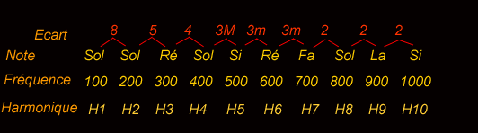

---

title: "Acústica del piano – frecuencia, amplitud y espectro armónico"

---

description: "Principios de la acústica aplicados al piano: frecuencia, amplitud, propagación del sonido y espectro armónico."

---

# Acústica del piano

El sonido es una variación de presión que se propaga en forma de ondas...

* *Acústica*: adjetivo que proviene del griego y significa "relativo a la percepción sonora".
  Vamos a abordar aquí algunas nociones sobre el sonido; no se trata de un curso de acústica propiamente dicho, sino simplemente de una pequeña introducción al tema.

* El sonido es una sensación, al igual que la vista, el olfato o el tacto. Se define como:
  "Toda variación de presión que puede ser detectada por el oído".

* Estas variaciones de presión son fenómenos de compresión y descompresión que generan un movimiento ondulatorio.

* El sonido se propaga por el aire a una velocidad aproximada de 340 m por segundo hasta llegar a esos maravillosos receptores que son nuestros oídos. Podemos dividir el oído humano en tres partes:

* El oído externo, compuesto por el pabellón auricular y el conducto auditivo, recibe las ondas sonoras que hacen vibrar el tímpano.
  El oído medio está formado por tres pequeños huesos articulados y mantenidos en su posición mediante músculos y ligamentos.
  El oído interno está constituido por los canales semicirculares y la cóclea, llena de líquido (linfa). Este líquido transmite cada estímulo a la membrana basilar, que a su vez está cubierta por miles de células sensoriales que envían la información al cerebro mediante impulsos nerviosos... ¡Uf! ¡Lo dejamos aquí!

* Tomemos ahora una imagen para visualizar mejor de qué estamos hablando. Imaginemos una piedra lanzada al agua. Cuando penetra en la superficie, desplaza el agua (compresión), y después el agua desplazada vuelve a subir (descompresión).

* Las ondas visibles en la superficie representan perfectamente el movimiento ondulatorio. La distancia y el número de ondas nos indican el tiempo y la intensidad de la vibración.

* La velocidad de la vibración es la frecuencia (en Hertz).

* El nivel de compresión y descompresión es la amplitud (en decibelios).

===================================================

## ESQUEMA

* En una onda sonora, la distancia que separa dos puntos se denomina longitud de onda. Esta longitud depende de la velocidad de propagación del sonido: cuanto mayor es la frecuencia, más agudo es el sonido; cuanto menor es, más grave será.

* Ejemplo: tomemos el LA de 440 Hertz = 440 vibraciones por segundo.
  Ahora tomemos el LA de 220 Hertz, situado una octava por debajo, por lo tanto más grave: LA 220 Hz = 220 vibraciones por segundo.
  Y si tomamos el LA de 880 Hz, una octava por encima del LA 440 Hz, ya lo ha adivinado: 880 vibraciones por segundo.

* Entonces, cuando una nota se toca y el sonido disminuye con el tiempo hasta desaparecer, ¿qué ocurre?
  Pues bien, el sonido disminuye en amplitud, pero su frecuencia permanece constante.

* Pero si el sonido de una nota fuera simplemente una onda sinusoidal pura, sería bastante desagradable de escuchar. Por eso, como dijo tan acertadamente el Sr. Fourier:
  "El sonido musical es una suma de movimientos sinusoidales y no un único movimiento sinusoidal".
  A esto se le denomina ESPECTRO ARMÓNICO.

* Si piensa que el espectro armónico es un fantasma blanco, está muy equivocado.
  El espectro armónico de una nota está compuesto por el sonido principal de dicha nota (fundamental) y por todos sus armónicos. Cada armónico es un múltiplo de la frecuencia del sonido principal.

* Para ilustrar este fenómeno, tomemos parte del espectro armónico de un SOL grave con una frecuencia de 100 Hz.

* Aquí H1 representa el armónico 1, que corresponde a la frecuencia fundamental.

* Durante la armonización de un piano, el técnico trabaja sobre la forma y la estructura de los martillos. Mediante el lijado o el punzado de las cabezas de los martillos, endurece o suaviza determinadas zonas para modificar el timbre de las notas.

* Gracias a su experiencia y a un gesto preciso, sabe exactamente cómo actuar para obtener el timbre deseado. La armonización consiste en resaltar determinados armónicos más que otros: potenciar los armónicos agudos para lograr un sonido brillante o incluso metálico, o potenciar los armónicos graves y medios para obtener una sonoridad más cálida y aterciopelada.

* Resumamos:

Definimos el sonido por:

* Su altura (frecuencia en Hertz).
* Su intensidad o potencia (amplitud en decibelios).
* Su timbre (espectro armónico).
* Su duración (en segundos).

---

* La frecuencia es el número de variaciones por segundo. Cuanto mayor es el número de variaciones, más agudo será el sonido, y viceversa.

* El rango audible del ser humano se sitúa aproximadamente entre 20 Hz y 20.000 Hz (el rango de un piano se extiende aproximadamente desde 27 Hz hasta 4.186 Hz).

* La intensidad depende de la potencia de vibración de la fuente sonora. Si lanzamos una piedra grande con fuerza al agua, el movimiento ondulatorio será mucho mayor que si dejamos caer suavemente una piedra pequeña.

* El timbre es el resultado del modo de vibración, del número de armónicos y de la distribución de estos armónicos. Si golpeamos una campana con un martillo metálico, los armónicos generados serán diferentes de los producidos si esa misma campana es golpeada con un martillo de madera (¡Ding! y ¡Bong!).

* La duración corresponde al tiempo durante el cual se emite el sonido.

