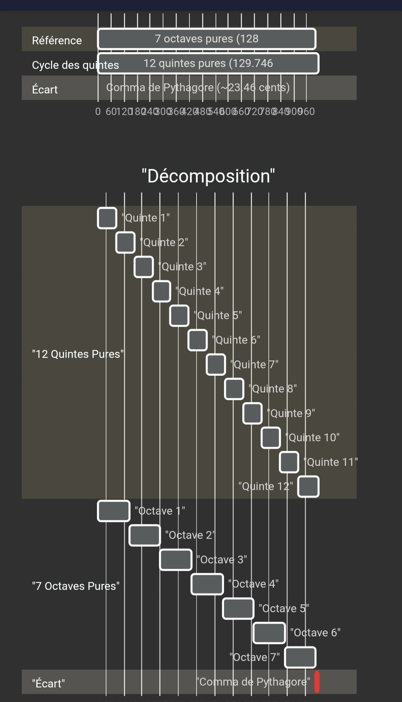

---

title: "El sonido – coma pitagórica, fenómeno de inarmonicidad, física acústica, amplitud y espectro armónico"
description: "El fenómeno de la inarmonicidad, acústica del piano y frecuencias, amplitud, propagación del sonido y espectro armónico. Afinación Serge Cordier"

---

# Acústica física avanzada del sonido del piano - Parte 2 - continuación de la página de acústica

---

## 1. La coma pitagórica

La coma pitagórica es un problema puramente matemático relacionado con los intervalos.

Si se construye una escala apilando 12 quintas puras con una determinada relación de frecuencias, no se obtienen exactamente 7 octavas. La diferencia es la coma pitagórica, de aproximadamente 23,46 cents.

Esto significa que es imposible construir un teclado con:

* todas las quintas perfectamente justas,
* y todas las octavas perfectamente justas.

Se trata de una restricción geométrica de las frecuencias que condujo al desarrollo de diferentes temperamentos, especialmente el temperamento igual utilizado en la actualidad.

---

Si un afinador afinara un piano ascendiendo de quinta pura en quinta pura (Do, Sol, Re, La, Mi, Si, Fa♯, Do♯, Sol♯, Re♯, La♯, Fa, Do), el último Do sería claramente más agudo que el Do obtenido al subir 7 octavas.

Para cerrar este "ciclo de quintas", que en realidad es una espiral, es necesario corregir este exceso.

***La coma pitagórica corresponde al intervalo microtonal residual de aproximadamente 23,46 cents que separa 12 quintas puras de 7 octavas perfectas.***

Las relaciones 2:1 y 3:2 representan proporciones matemáticas entre las frecuencias de dos notas musicales. En acústica, son los dos intervalos más puros y fundamentales para el oído humano.

A continuación se muestra el significado concreto de estas dos relaciones:

### 1. La relación 2:1 (La octava)

La relación 2:1 significa que la nota más aguda vibra exactamente dos veces más rápido que la nota más grave.

> Ejemplo: si la nota La de referencia vibra a 440 Hz (ciclos por segundo), el La de la octava superior vibrará a 880 Hz (440 × 2). El La de la octava inferior vibrará a 220 Hz (440 ÷ 2).

**Efecto para el oído:** es el intervalo con mayor grado de fusión que existe. Para el oído humano, ambas notas suenan casi como la misma nota, pero en registros diferentes.

### 2. La relación 3:2 (La quinta)

La relación 3:2 (o 1,5) significa que por cada tres vibraciones de la nota más aguda, la nota más grave produce dos. La nota aguda vibra 1,5 veces más rápido que la grave.

> Ejemplo: partiendo de un Do que vibra a 200 Hz, la quinta superior (Sol) vibrará a 300 Hz (200 × 3/2).

**Efecto para el oído:** es el intervalo más estable y consonante después de la octava. Constituye la base de la construcción de la mayoría de las escalas musicales en todo el mundo (el ciclo de quintas).

---

#### Repartir la coma pitagórica (El temperamento)

Para resolver este problema físico, se desarrollaron varios sistemas de afinación denominados temperamentos:

* **1. El temperamento igual:** es el estándar moderno para el piano. La coma pitagórica se distribuye equitativamente entre las 12 quintas del teclado. Cada quinta queda así ligeramente "estrechada" en unos 2 cents respecto a una quinta pura. Todas las tonalidades suenan de manera equivalente, permitiendo modular libremente.

* **2. Los temperamentos históricos:** los temperamentos desiguales (como Werckmeister o Kirnberger) mantenían algunas quintas puras y acumulaban el resto de la coma en otros intervalos. Esto otorgaba un "color" particular y una tensión propia a cada tonalidad.

* **3. La afinación de piano de Serge Cordier (quintas puras y octavas progresivamente más amplias):** las quintas se vuelven prácticamente puras, mientras que las octavas se amplían ligeramente.

<small>(La «curva de Cordier» suele representarse mediante desviaciones, en cents, respecto al temperamento igual. Estas desviaciones aumentan progresivamente al alejarse de la nota de referencia, generando una curva característica).</small>

## 2. El fenómeno de la inarmonicidad

El fenómeno de la inarmonicidad en un piano designa el hecho de que las frecuencias de los parciales (armónicos) de una cuerda real no son exactamente múltiplos enteros de la frecuencia fundamental.

* La inarmonicidad es un fenómeno físico debido a la rigidez de las cuerdas.

Una cuerda ideal produciría parciales perfectamente armónicos.

Pero las cuerdas reales de un piano son rígidas. Los parciales son ligeramente más agudos y la desviación aumenta con el número del parcial. Así, el segundo parcial de una nota grave no se encuentra exactamente a la octava de su fundamental, sino un poco más arriba.

> En este esquema, los parciales (armónicos) son perfectamente puros.

---

### Tomemos el caso de un Sol con una frecuencia fundamental de 100 Hz

> H1 = 100 Hz / B = coeficiente de inarmonicidad. H1 es la fundamental; H2, H3, etc., son los armónicos 2, 3, etc.

### 1. Caso ideal sin fenómeno de inarmonicidad (B = 0)

| Parcial | Frecuencia real |
| :-----: | :-------------- |
|    H1   | 100 Hz          |
|    H2   | 200 Hz          |
|    H3   | 300 Hz          |
|    H4   | 400 Hz          |
|    H5   | 500 Hz          |
|    H6   | 600 Hz          |

### 2. Caso realista de piano (B = 0,0005)

| Parcial | Frecuencia real |
| :-----: | :-------------- |
|    H1   | 100 Hz          |
|    H2   | 200,1 Hz        |
|    H3   | 300,7 Hz        |
|    H4   | 401,6 Hz        |
|    H5   | 503,1 Hz        |
|    H6   | 605,4 Hz        |

### 3. Caso más inarmónico (cuerda corta, B = 0,002; frecuente en los pianos de cola pequeños)

| Parcial | Frecuencia real |
| :-----: | :-------------- |
|    H1   | 100,1 Hz        |
|    H2   | 200,8 Hz        |
|    H3   | 302,7 Hz        |
|    H4   | 406,3 Hz        |
|    H5   | 512,3 Hz        |
|    H6   | 621,2 Hz        |

---

Debido a esta desviación, es imposible afinar un piano utilizando únicamente intervalos acústicamente perfectos. Los afinadores de piano compensan este exceso distribuyéndolo a lo largo de todas las notas del instrumento. En el caso 3, el trabajo necesario para corregir la inarmonicidad será considerable.

---

### EN RESUMEN

### El trabajo del afinador de piano consiste en distribuir la famosa coma pitagórica y compensar el fenómeno de inarmonicidad propio de cada piano.

* **a.** El temperamento igual corrige el problema de la coma pitagórica mediante la distribución de esta coma entre los 12 semitonos.

* **b.** La inarmonicidad hace que el afinador se aparte todavía un poco más de las frecuencias teóricas del temperamento igual aplicando lo que se denomina *stretch tuning* (afinación estirada).

La coma pitagórica explica por qué es necesario un temperamento, mientras que la inarmonicidad explica por qué un piano real ni siquiera se afina exactamente según ese temperamento teórico.

Se trata de dos fenómenos independientes, pero ambos son determinantes en la afinación del piano. Durante la afinación real de un piano, ambos efectos se combinan.

---
