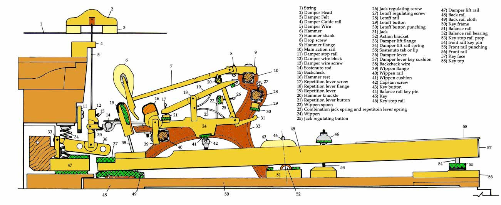

---

title: "Cómo funciona un piano – mecánica martillos cuerdas"
description: "Funcionamiento del piano explicado: acción mecánica, martillos, cuerdas y sistema de escape."

---

# Cómo funciona un piano

 

Cuando se presiona una tecla, se activa un sistema mecánico que hace golpear un martillo sobre las cuerdas...

* Simplificando: cuando se pulsa una tecla, esta eleva mediante un sencillo sistema de palanca todo un conjunto de pequeñas piezas (llamado mecánica del piano), lo que provoca que un martillo golpee una o varias cuerdas.

* El golpe del martillo hace vibrar la cuerda o las cuerdas. Esta vibración es amplificada por la tabla armónica, que actúa como un altavoz a través del puente.

* Observemos el fenómeno:
Un pequeño vídeo para visualizarlo (Ediciones Larousse)

<video src="../images/grand-piano-meca.mp4" controls width="100%">
  Su navegador no admite la reproducción de vídeos HTML5.
</video>

### El funcionamiento de la mecánica en 4 etapas

El sistema (presentado aquí en un piano de cola) se basa en un principio de escape que permite al martillo golpear la cuerda y rebotar inmediatamente, incluso cuando la tecla permanece pulsada.

1. **Reposo:** El apagador descansa sobre la cuerda para impedir que vibre. El martillo se encuentra en posición baja.

2. **Pulsación (ejecución):** Cuando se presiona la tecla, su parte posterior se eleva. El piloto empuja el balancín, que a su vez eleva la palanca de escape. Paralelamente, la cuchara del apagador levanta el apagador para liberar la cuerda.

3. **Escape (golpe):** La palanca de escape impulsa el martillo hacia arriba. Justo antes de que el martillo alcance la cuerda, la base de la palanca de escape entra en contacto con el tornillo de regulación, obligándola a pivotar hacia atrás. El martillo queda entonces liberado (escape) y completa su recorrido únicamente gracias a su inercia antes de golpear la cuerda y rebotar.

4. **Retención:** Después del rebote, el martillo es capturado a media carrera por el atrape con el contro atrape (la pieza vertical situada al extrema de la tecla). Esto evita que golpee la cuerda una segunda vez. La palanca de repetición permite que el mecanismo de escape vuelva a colocarse bajo el rodillo del martillo tan pronto como la tecla se libera ligeramente, permitiendo repetir la nota muy rápidamente sin necesidad de soltar completamente la tecla.

### Diferencia entre piano de cola y piano vertical

* **Piano de cola (mecánica horizontal):** Utiliza la gravedad para devolver el martillo a su posición inicial. Su mecánica (denominada mecánica Erard o de doble escape) es extremadamente rápida y permite repetir una misma nota hasta 15 veces por segundo. Numerosas publicaciones especializadas describen en detalle esta compleja geometría mecánica.

* **Piano vertical (mecánica vertical):** Los martillos se desplazan horizontalmente. Al no beneficiarse de la gravedad para regresar a su posición, la mecánica utiliza muelles de retorno y cintas de recuperación, lo que hace que la repetición sea ligeramente más lenta.

---

Un pequeño vídeo sobre la fabricación y el funcionamiento del piano (*Investigaciones Paranormales*)

<video src="../images/fonctionnement-piano.mp4" controls width="100%">
  Su navegador no admite la reproducción de vídeos HTML5.
</video>

*https://www.youtube.com/watch?v=r9I_XU2zZ70*

