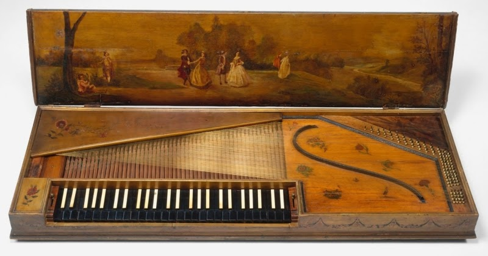

---

title: "Historia del piano – del clavecín al piano moderno"
description: "Evolución del piano desde el clavecín y el clavicordio hasta el piano moderno de concierto."

---

# Historia del piano

## El origen del piano

*El piano moderno tiene su origen en instrumentos de cuerda como el clavecín y el clavicordio...*
* Aunque el piano tal como lo conocemos hoy apareció hace aproximadamente tres siglos, sus orígenes se remontan mucho más atrás, hasta el siglo XI, época de la [cítara](https://en.wikipedia.org/wiki/Kithara) y del [salterio](https://en.wikipedia.org/wiki/Hammered_dulcimer), que evolucionó hacia el [clavicordio](https://en.wikipedia.org/wiki/Clavichord) tras la incorporación de un teclado.   

* En estos primeros instrumentos, pequeños pernos fijados a las teclas golpeaban las cuerdas desde abajo. El [monocordio](https://en.wikipedia.org/wiki/Monochord), también llamado manicordio, inspiraría posteriormente el desarrollo de numerosos instrumentos de cuerda percutida.

* Más que un instrumento musical, el monocordio era una herramienta de estudio científico. Ya en el siglo VI a.C., Pitágoras lo utilizaba para investigar las relaciones matemáticas entre los sonidos y sentar las bases de la teoría musical occidental.

* Al añadir más cuerdas al monocordio nació el policordio. La cítara, el monocordio y el policordio constituyen los fundamentos de la estructura acústica que más tarde daría origen al piano.

* Las cuerdas están tensadas entre dos puntos fijos. El puente transmite sus vibraciones a la tabla armónica, encargada de amplificar el sonido.

* En 1521, el italiano Hieronymus Bononiensis construyó uno de los primeros clavecines, instrumento fundamental en la evolución hacia el fortepiano. En el clavecín, las cuerdas no son golpeadas, sino pulsadas mediante plectros. Dos años más tarde, en 1523, el italiano Fransiscus Portalupis construyó la primera espineta.

* Durante el siglo XVI apareció el clavicordio de cuatro octavas y media. En el siglo XVIII, los constructores ampliaron progresivamente la extensión de los teclados de cinco a seis octavas, hasta alcanzar las siete octavas durante el siglo XIX.

* Finalmente, alrededor de 1700, el italiano [Bartolomeo Cristofori](https://en.wikipedia.org/wiki/Bartolomeo_Cristofori), constructor de clavecines al servicio de los Médici, creó el primer piano al sustituir los mecanismos que pulsaban las cuerdas por martillos capaces de golpearlas. Nacía así el *gravicembalo col piano e forte*, precursor directo del piano moderno.

* Entre 1730 y 1740 aparecieron los primeros pianos de cola. En 1760, Johannes Zumpe y Americus Backers retomaron los principios mecánicos de Cristofori para desarrollar el primer piano cuadrado.

* A comienzos del siglo XIX, el fortepiano, capaz de producir matices dinámicos imposibles en el clavecín, fue imponiéndose progresivamente. La fabricación de clavecines y clavicordios entró entonces en declive, mientras los constructores concentraban sus esfuerzos en perfeccionar el nuevo instrumento.

### Fechas clave en la evolución del piano

* **1703:** Carlo GRIMALDI transforma un clavecín en un *cembalo con martelletti*, donde pequeños martillos metálicos golpean las cuerdas en lugar de pulsarlas. [wiki](https://en.wikipedia.org/wiki/Folding_harpsichord)

* **1709:** Bartolomeo CRISTOFORI presenta el primer piano funcional. Sus martillos de madera son impulsados por un complejo mecanismo dotado de escape y apagadores. [wiki](https://en.wikipedia.org/wiki/Bartolomeo_Cristofori)

* **1717:** Christoph SCHRÖTER desarrolla una mecánica con martillos invertidos.

* **1726:** Cristofori perfecciona su invento. Los martillos pasan a estar recubiertos de pergamino y cuero, los apagadores se mejoran y aparece un dispositivo precursor del pedal forte.

* **1766:** Johannes ZUMPE construye el primer piano cuadrado. [wiki](https://en.wikipedia.org/wiki/Johannes_Zumpe)

* **1772:** BACKERS construye el primer piano de cola equipado con acción inglesa.

* **1773:** Johann Andreas STEIN introduce la denominada acción vienesa.

* **1777:** Sébastien ÉRARD fabrica su primer piano. [wiki](https://en.wikipedia.org/wiki/S%C3%A9bastien_%C3%89rard)

* **1780:** ZUMPE desarrolla una mecánica de doble piloto.

* **1781:** BROADWOOD construye su primer gran piano.

* **1784:** Anton WALTER construye para Mozart un fortepiano equipado con el sistema *una corda*.

* **1786:** ÉRARD perfecciona la mecánica de doble piloto.

* **1788:** BROADWOOD, junto con Cavalo y Gray, determina que el punto óptimo de impacto del martillo debe situarse aproximadamente a un noveno de la longitud vibrante de la cuerda.

* **1789:** SOUTHWELL construye uno de los primeros pianos verticales en Dublín.

* **1794:** BROADWOOD introduce los pianos de seis octavas.

* **1799:** Joseph SMITH desarrolla uno de los primeros bastidores metálicos para soportar mejor la creciente tensión de las cuerdas.

* **1806:** Sébastien ÉRARD inventa la agrafe, pieza que mantiene las cuerdas perfectamente alineadas y define uno de los extremos de su longitud vibrante.

* **1810:** ÉRARD desarrolla el sistema de pedales que inspirará el utilizado en los pianos modernos.

* **1810:** PLEYEL solicita una patente para el uso de cuerdas de cobre y acero templado. [wiki](https://en.wikipedia.org/wiki/Pleyel_et_Cie)

* **1815:** BROADWOOD comienza a incorporar elementos metálicos estructurales en sus pianos.

* **1821:** ÉRARD inventa la famosa acción de doble escape, uno de los avances más importantes de la historia del piano, que permite repetir una nota con gran rapidez.

* **1822:** ÉRARD añade barras de refuerzo sobre la tabla armónica, permitiendo aumentar considerablemente la tensión y el diámetro de las cuerdas.

* **1825:** Alpheus BABCOCK patenta el bastidor completo de hierro fundido.

* **1826:** Henri PAPE introduce los martillos recubiertos de fieltro, sustituyendo definitivamente al cuero.

* **1827:** BROADWOOD utiliza placas metálicas y refuerzos estructurales que anticipan el futuro bastidor completo.

* **1827:** James STEWART desarrolla nuevas técnicas de encordado que constituyen el origen del sistema moderno.

* **1830:** Aparecen los primeros pianos de cola equipados con la acción Érard.

* **1835:** Comienza la industrialización de la fabricación de pianos en Alemania, incluyendo procesos mecanizados para el recubrimiento de fieltro de los martillos.

* **1840:** Henri HERZ desarrolla una versión simplificada de la acción Érard, utilizada todavía en numerosos pianos verticales.

* **1842:** Henri PAPE construye el primer piano de cola de ocho octavas. [wiki](https://en.wikipedia.org/wiki/Jean-Henri_Pape)

* **1842:** ISHERMANN funda una de las primeras industrias especializadas en la fabricación de acciones de piano.

* **1843:** CHICKERING patenta un bastidor metálico de una sola pieza para piano de cola.

* **1843:** BORD inventa el contra-agrafe o barra de presión, que mejora la estabilidad y el rendimiento acústico de las cuerdas.

* **1859:** STEINWAY construye el primer gran piano de concierto moderno con encordado cruzado. [wiki](https://en.wikipedia.org/wiki/Steinway_%26_Sons)

* **1863:** STEINWAY introduce el encordado cruzado en sus pianos verticales.

* **1867:** STEINWAY generaliza el uso del bastidor completo de hierro fundido.

* **1873:** BLÜTHNER inventa el sistema *Aliquot*, que añade una cuarta cuerda resonante no golpeada por el martillo. Esta cuerda vibra por simpatía y enriquece notablemente el espectro armónico del instrumento. Este sistema continúa siendo una característica distintiva de los pianos Blüthner. [wiki](https://en.wikipedia.org/wiki/Bl%C3%BCthner)

