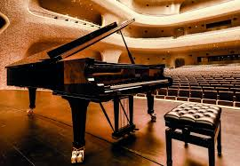

---

title: "Piano Tech – mecánica y acústica del piano"
description: "Documentación técnica sobre el piano: mecánica, acústica, afinación, historia y sistemas modernos como Silent y control de humedad, comprar un piano"

---

# Piano Tech
[french](../fr/index.md)   
[spanish](../es/index.md)

**Esta pagina explora el universo del piano desde todos sus ángulos:**

>- Historia y evolución
>- Mecanismos y funcionamiento
>- El arte de la afinación y una introducción a la física acústica
>- Sistemas modernos (Silent, Dampp-Chaser)

---

*<small> El autor Stefano Etienne Landi [email](mailto:pianos@ik.me) es un tecnico de pianos con 35 años de experiencia, diplomado por la Escuela Francesa, premio de excelencia en oficios de arte. Actualmente es responsable técnico de una importante empresa europea especializada en pianos de prestigio. [Fazioli](https://www.royalpianos.com/en/product-category/new-pianos/fazioli-pianos/) [Steinway](https://www.steinway.com/about) [Bosendorfer](https://www.royalpianos.com/en/product-category/new-pianos/bosendorfer-en/) [Bechstein](https://www.bechstein.com/en/) [Shigeru](https://www.royalpianos.com/en/product-category/new-pianos/kawai-en/shigeru-kawai-en/) [Grotrian-Steinweg](https://www.grotrian.de/en/instruments/grand-pianos/) [Sauter](https://sauter-pianos.de/english/home.html) [Schimmel](https://www.schimmel-pianos.de/en/) [Yamaha (Serie CF / CFX)](https://uk.yamaha.com/en/musical-instruments/pianos/products/grand-pianos/cfx-02/), etc... </small>*