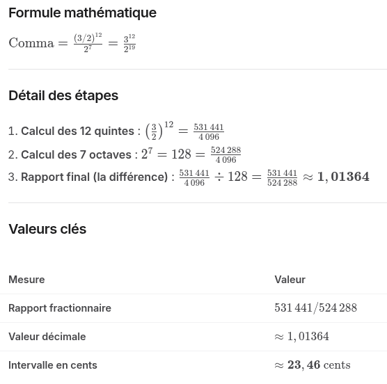

---

title: "Le son – comma pythagoricien, Le phénomène d'inharmonicité, physique acoustique, amplitude et spectre harmonique"
description: "Le phénomène d'inharmonicité, Acoustique du piano fréquences, Amplitude, propagation du son et spectre harmonique. Accord Serge Cordier"

---

# Acoustique physique aprofondie du son du piano - partie 2 - suite de la page acoustique

---

>***En Accordage de piano, 12 quintes pures sont plus grandes que 7 octaves. Cette différence mathématique s'appelle le comma pythagoricien***

Si un accordeur accordait un piano en montant de quinte pure en quinte pure (Do, Sol, Ré, La, Mi, Si, Fa♯, Do♯, Sol♯, Ré♯, La♯, Fa, Do), le dernier Do serait nettement plus aigu que le Do obtenu en montant de 7 octaves.
Pour fermer ce "cycle des quintes" qui est en réalité une spirale, il faut corriger ce surplus.

Le phénomène d'inharmonicité dans un piano désigne le fait que les fréquences des partiels (harmoniques) d'une corde réelle ne sont pas exactement des multiples entiers de la fréquence fondamentale.

---

- ### Prenons le cas d'un Sol avec une fondamental de 100hz

   
> H1=100 Hz / B=coefficient d'inharmonicité. H1 est la fondamentale, H2, H3 ..  sont les harmoniques 2, 3 ...

### 1- Cas idéal ou il n'y aurait pas de phénomène d'inharmonicité  (B = 0) 

|  Partiel |	Fréquence réelle |
| :---: | :--- |
| H1 | 100 Hz |
| H2 | 200 Hz |
| H3 | 300 Hz |
| H4 | 400 Hz |
| H5 | 500 Hz |
| H6 | 600 Hz |

### 2- Cas réaliste de piano (B = 0,0005)

|  Partiel |	Fréquence réelle |
| :---: | :---|
| H1 | 100 Hz |
| H2 | 200,1 Hz |
| H3 | 300,7 Hz |
| H4 | 401,6 Hz |
| H5 | 503,1 Hz |
| H6 | 605,4 Hz |

### 3- Cas plus inharmonique (corde courte, B = 0,002 souvent les petits pianos a queue) 

|  Partiel |	Fréquence réelle |
| :---: | :--- |
| H1 | 100,1 Hz |
| H2 | 200,8 Hz |
| H3 | 302,7 Hz |
| H4 | 406,3 Hz |
| H5 | 512,3 Hz |
| H6 | 621,2 Hz |

---

- En raison de cet écart, il est impossible d'accorder un piano uniquement avec des intervalles acoustiquement parfaits. Les accordeurs de pianos trichent pour répartir ce surplus sur l'ensemble des notes de l'instrument. Dans le cas 3 le travail de l'accordeur pour rattraper le phénomène d'inharmonicité sera assez consequent !

---

## Résume mathématique du coma pythagoricien

- En acoustique, les intervalles musicaux s'expriment par des rapports de fréquences géométriques :
- Si on divise une corde par 2 on a l'octave (supérieure)
On divise une corde par 3 on a la quinte.

---

***Le comma pythagoricien correspond à l'intervalle microtonal résiduel de ≈ 23,46 cents qui sépare 12 quintes pures de 7 octaves parfaites.***

---

Les rapports 2:1 et 3:2 représentent des proportions mathématiques entre les fréquences de deux notes de musique. En acoustique, ce sont les deux intervalles les plus purs et les plus fondamentaux pour l'oreille humaine.
Voici la signification concrète de ces deux rapports :

1. Le rapport 2:1 (L'Octave)
Le rapport 2:1 signifie que la note la plus haute vibre exactement deux fois plus vite que la note la plus basse.

> Exemple: Si la note La de référence vibre à 440 Hz (cycles par seconde), le La de l'octave supérieure vibrera à 880 Hz (440×2). Le La de l'octave inférieure vibrera à 220 Hz (440/2).
L'effet à l'oreille: C'est l'intervalle le plus fusionnel qui existe. Pour l'oreille humaine, ces deux notes sonnent presque comme la même note, mais à une hauteur différente.

2. Le rapport 3:2 (La Quinte)
Le rapport 3:2 (ou 1,5) signifie que pour trois vibrations de la note la plus haute, la note la plus basse n'en produit que deux. La note aiguë vibre 1,5 fois plus vite que la note grave.

> Exemple: Enpartant d'un Do qui vibre à 200 Hz, la quinte supérieure (Sol) vibrera à 300 Hz (200×32).
L'effet à l'oreille : C'est l'intervalle le plus stable et le plus consonant après l'octave. C'est la base de la construction de la majorité des échelles musicales à travers le monde (le cycle des quintes).

---

#### Répartir le comma de pythagore (Le Tempérament)

- Pour résoudre ce problème physique, on a développé plusieurs systèmes d'accordage nommés tempéraments :

- 1- Le tempérament égal : C'est la norme moderne pour le piano. On divise le comma pythagoricien équitablement entre les 12 quintes du clavier. Chaque quinte est ainsi légèrement "rétrécie" de 2 cents par rapport à une quinte pure. Toutes les tonalités sonnent de la même manière, permettant de moduler à l'infini.   

- 2- Les tempéraments historiques : Les tempéraments inégaux (comme Werckmeister ou Kirnberger) laissaient certaines quintes pures et accumulaient le reste de la coma sur d'autres intervalles. Cela donnait une "couleur" unique et une tension propre à chaque tonalité.   

- 3- L'accord de piano Serge Cordier (quintes pures, octave plus grandes progressivement)
Les quintes deviennent pratiquement pures, tandis que les octaves sont légèrement élargies.

> Par exemple, en partant de La₄ = 440 Hz :
> - La♯ ≈ 440 × r = 466,24 Hz
> - Si ≈ 440 × r² = 494,05 Hz
> - Do ≈ 440 × r³ = 523,52 Hz
> - et ainsi de suite.

<small>(La « courbe de Cordier » est généralement représentée en écarts (en cents) par rapport au tempérament égal. Ces écarts augmentent progressivement lorsqu'on s'éloigne de la note de référence, ce qui donne une courbe caractéristique.)</small>

---

[livre de Serge Cordier, le piano bien tempéré](serge-cordier-piano-bien-tempere.pdf)

