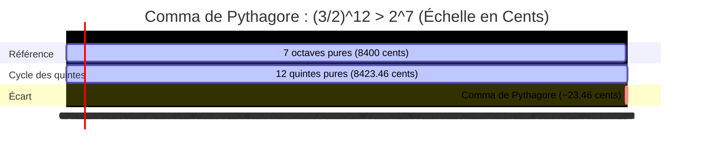
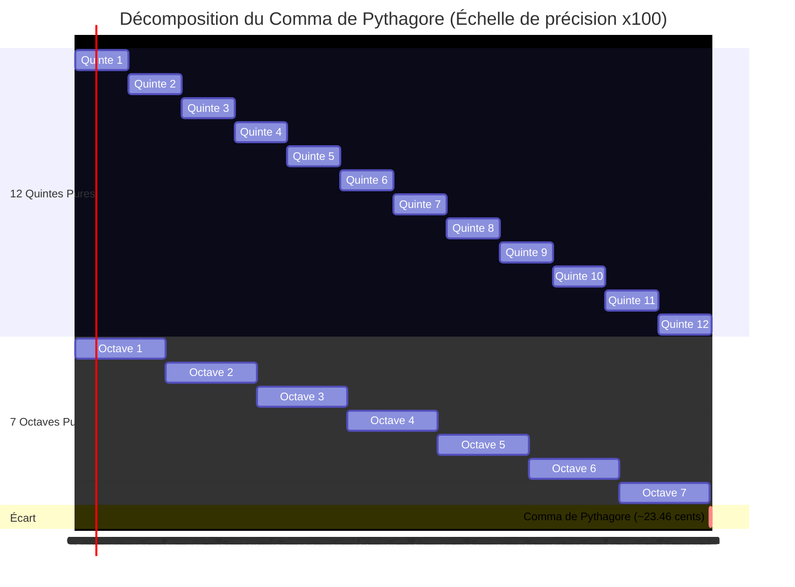
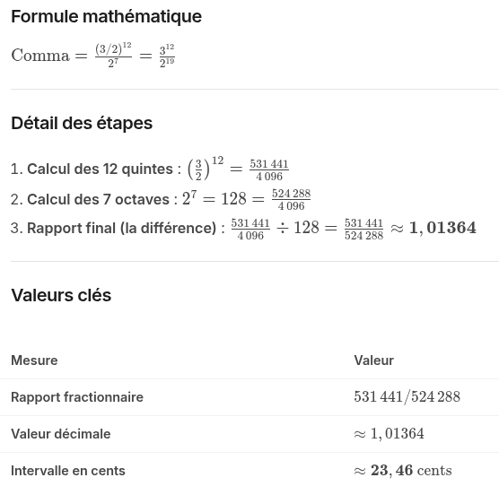
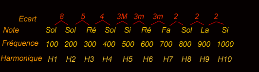

---

title: "Le son – comma pythagoricien, Le phénomène d'inharmonicité, physique acoustique, amplitude et spectre harmonique"
description: "Le phénomène d'inharmonicité, Acoustique du piano fréquences, Amplitude, propagation du son et spectre harmonique. Accord Serge Cordier"

---

# Acoustique physique aprofondie du son du piano - partie 2 - suite de la page acoustique

---

## 1. Le comma de Pythagore

Le comma de Pythagore est un problème purement mathématique lié aux intervalles.

Si l'on construit une gamme en empilant 12 quintes pures de rapport : on n'obtient pas exactement 7 octaves. L'écart est le comma de Pythagore, d'environ 23,46 cents.

Cela signifie qu'il est impossible de construire un clavier avec :

-   toutes les quintes parfaitement justes,
    
-   et toutes les octaves parfaitement justes.
    

C'est une contrainte géométrique des fréquences qui a conduit aux différents tempéraments, notamment le tempérament égal utilisé aujourd'hui.

---

```mermaid
gantt
    title Comma de Pythagore : (3/2)^12 > 2^7 (Échelle en Cents)
    dateFormat  YYYY-MM-DD
    axisFormat  %j
    tickInterval 1day

    section Référence
    7 octaves pures (8400 cents)             :active, o, 2026-01-01, 8400d

    section Cycle des quintes
    12 quintes pures (8423.46 cents)         :active, q, 2026-01-01, 8423d

    section Écart
    Comma de Pythagore (~23.46 cents)        :crit, c, after o, 23d

```

---

```mermaid
gantt
    title Décomposition du Comma de Pythagore (Échelle de précision x100)
    dateFormat YYYY-MM-DD
    axisFormat %j
    tickInterval 1day

    section 12 Quintes Pures
    Quinte 1  :q1, 2026-01-01, 702d
    Quinte 2  :q2, after q1, 702d
    Quinte 3  :q3, after q2, 702d
    Quinte 4  :q4, after q3, 702d
    Quinte 5  :q5, after q4, 702d
    Quinte 6  :q6, after q5, 702d
    Quinte 7  :q7, after q6, 702d
    Quinte 8  :q8, after q7, 702d
    Quinte 9  :q9, after q8, 702d
    Quinte 10 :q10, after q9, 702d
    Quinte 11 :q11, after q10, 702d
    Quinte 12 :q12, after q11, 702d

    section 7 Octaves Pures
    Octave 1 :o1, 2026-01-01, 1200d
    Octave 2 :o2, after o1, 1200d
    Octave 3 :o3, after o2, 1200d
    Octave 4 :o4, after o3, 1200d
    Octave 5 :o5, after o4, 1200d
    Octave 6 :o6, after o5, 1200d
    Octave 7 :o7, after o6, 1200d

    section Écart
    Comma de Pythagore (~23.46 cents) :crit, after o7, 24d
```

---

Si un accordeur accordait un piano en montant de quinte pure en quinte pure (Do, Sol, Ré, La, Mi, Si, Fa♯, Do♯, Sol♯, Ré♯, La♯, Fa, Do), le dernier Do serait nettement plus aigu que le Do obtenu en montant de 7 octaves.
Pour fermer ce "cycle des quintes" qui est en réalité une spirale, il faut corriger ce surplus.

***Le comma pythagoricien correspond à l'intervalle microtonal résiduel de ≈ 23,46 cents qui sépare 12 quintes pures de 7 octaves parfaites.***

Les rapports 2:1 et 3:2 représentent des proportions mathématiques entre les fréquences de deux notes de musique. En acoustique, ce sont les deux intervalles les plus purs et les plus fondamentaux pour l'oreille humaine.
Voici la signification concrète de ces deux rapports :

1. Le rapport 2:1 (L'Octave)
Le rapport 2:1 signifie que la note la plus haute vibre exactement deux fois plus vite que la note la plus basse.

> Exemple: Si la note La de référence vibre à 440 Hz (cycles par seconde), le La de l'octave supérieure vibrera à 880 Hz (440×2). Le La de l'octave inférieure vibrera à 220 Hz (440/2).
L'effet à l'oreille: C'est l'intervalle le plus fusionnel qui existe. Pour l'oreille humaine, ces deux notes sonnent presque comme la même note, mais à une hauteur différente.

2. Le rapport 3:2 (La Quinte)
Le rapport 3:2 (ou 1,5) signifie que pour trois vibrations de la note la plus haute, la note la plus basse n'en produit que deux. La note aiguë vibre 1,5 fois plus vite que la note grave.

> Exemple: Enpartant d'un Do qui vibre à 200 Hz, la quinte supérieure (Sol) vibrera à 300 Hz (200×32).
L'effet à l'oreille : C'est l'intervalle le plus stable et le plus consonant après l'octave. C'est la base de la construction de la majorité des échelles musicales à travers le monde (le cycle des quintes).

---

#### Répartir le comma de pythagore (Le Tempérament)

- Pour résoudre ce problème physique, on a développé plusieurs systèmes d'accordage nommés tempéraments :

- 1- Le tempérament égal : C'est la norme moderne pour le piano. On divise le comma pythagoricien équitablement entre les 12 quintes du clavier. Chaque quinte est ainsi légèrement "rétrécie" de 2 cents par rapport à une quinte pure. Toutes les tonalités sonnent de la même manière, permettant de moduler à l'infini.   

- 2- Les tempéraments historiques : Les tempéraments inégaux (comme Werckmeister ou Kirnberger) laissaient certaines quintes pures et accumulaient le reste de la coma sur d'autres intervalles. Cela donnait une "couleur" unique et une tension propre à chaque tonalité.   

- 3- L'accord de piano Serge Cordier (quintes pures, octave plus grandes progressivement)
Les quintes deviennent pratiquement pures, tandis que les octaves sont légèrement élargies.

<small>(La « courbe de Cordier » est généralement représentée en écarts (en cents) par rapport au tempérament égal. Ces écarts augmentent progressivement lorsqu'on s'éloigne de la note de référence, ce qui donne une courbe caractéristique.)</small>

---

[livre de Serge Cordier, le piano bien tempéré](serge-cordier-piano-bien-tempere.pdf)

---

## 2. Le phénomène d'inharmonicité
Le phénomène d'inharmonicité dans un piano désigne le fait que les fréquences des partiels (harmoniques) d'une corde réelle ne sont pas exactement des multiples entiers de la fréquence fondamentale.

- L'inharmonicité est un phénomène physique dû à la rigidité des cordes.

Une corde idéale produirait des partiels pures
Mais les cordes réelles du piano sont rigides. Les partiels sont légèrement plus aigus et l'écart augmente avec le numéro du partiel. Ainsi, le deuxième partiel d'une note grave n'est pas exactement à l'octave de sa fondamentale, il est un peu plus haut.

   
> sur ce shema les partiels (harmoniques) sont pures

---

- ### Prenons le cas d'un Sol avec une fondamental de 100hz

> H1=100 Hz / B=coefficient d'inharmonicité. H1 est la fondamentale, H2, H3 ..  sont les harmoniques 2, 3 ...

### 1- Cas idéal ou il n'y aurait pas de phénomène d'inharmonicité  (B = 0) 

|  Partiel |	Fréquence réelle |
| :---: | :--- |
| H1 | 100 Hz |
| H2 | 200 Hz |
| H3 | 300 Hz |
| H4 | 400 Hz |
| H5 | 500 Hz |
| H6 | 600 Hz |

### 2- Cas réaliste de piano (B = 0,0005)

|  Partiel |	Fréquence réelle |
| :---: | :---|
| H1 | 100 Hz |
| H2 | 200,1 Hz |
| H3 | 300,7 Hz |
| H4 | 401,6 Hz |
| H5 | 503,1 Hz |
| H6 | 605,4 Hz |

### 3- Cas plus inharmonique (corde courte, B = 0,002 souvent les petits pianos a queue) 

|  Partiel |	Fréquence réelle |
| :---: | :--- |
| H1 | 100,1 Hz |
| H2 | 200,8 Hz |
| H3 | 302,7 Hz |
| H4 | 406,3 Hz |
| H5 | 512,3 Hz |
| H6 | 621,2 Hz |

---

- En raison de cet écart, il est impossible d'accorder un piano uniquement avec des intervalles acoustiquement parfaits. Les accordeurs de pianos trichent pour répartir ce surplus sur l'ensemble des notes de l'instrument. Dans le cas 3 le travail de l'accordeur pour rattraper le phénomène d'inharmonicité sera assez consequent !

---

### EN RESUME
### Le travail de l'accordeur de piano sera de répartir le fameux comma de pythagore et de rattrapper le phénomène d'inharmonicité propre a chaque piano.

- a.  le tempérament égal corrige le problème du comma de Pythagore, répartittion du comma de Pythagore sur les 12 demi-tons.
  
- b.  l'inharmonicité fait que l'accordeur s'écarte encore un peu des fréquences théoriques du tempérament égal en pratiquant ce qu'on appelle le stretch tuning (accord étiré).

le comma de Pythagore explique pourquoi on a besoin d'un tempérament et l'inharmonicité explique pourquoi un piano réel n'est même pas accordé exactement selon ce tempérament théorique. Ce sont deux phénomènes indépendants, mais tous deux déterminants dans l'accordage du piano.
, lors de l'accordage réel d'un piano, les deux effets se combinent.

---

