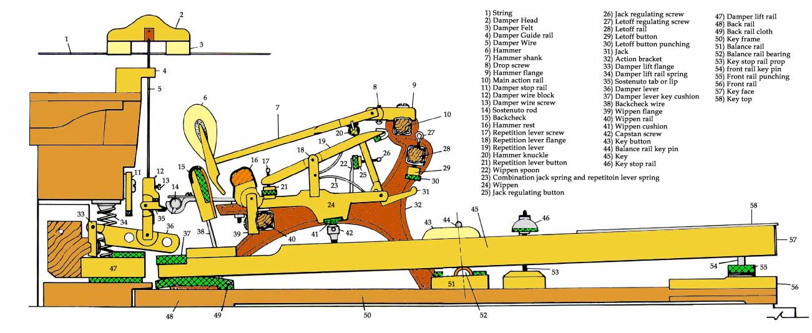

---

title: "Fonctionnement du piano – mécanique des marteaux et des cordes"
description: "Fonctionnement du piano : mécanique des marteaux, des cordes et principe d’échappement."

---

# Comment fonctionne un piano

 
 
 ---
 
 ## Animation interactive de la mécanique du piano

 
 ---
 
 <!-- 1. Le conteneur responsive -->

    

        
        <!-- Bouton de démarrage optimisé pour le tactile -->
        <button id="start-flash-btn" onclick="lancerAnimation()" style="position: absolute; top: 50%; left: 50%; transform: translate(-50%, -50%); padding: 15px 30px; background-color: #ffcc00; color: #000; border: none; font-weight: bold; border-radius: 5px; cursor: pointer; font-size: 18px; width: 80%; max-width: 300px; z-index: 10;">
            Démarrer l'animation
        </button>
        
    

<!-- 2. Le script avec gestion de l'affichage -->

 
- En simplifiant: quand on appuie la touche, elle va soulever par un simple système de balancier, tout un ensemble de petites pièces, (appele mécanique du piano), ce qui va entrainer la frappe d'un marteau sur une ou plusieurs cordes.

- La frappe du marteau va faire vibrer la ou les cordes, vibration qui va etre amplifiée par la table d'harmonie qui agit comme un haut-parleur en passant par le chevalet.

* une petite video pour visualiser
 (Editions Larousse)

<video src="../images/grand-piano-meca.mp4" controls width="100%">
  Su navegador no admite la reproducción de vídeos HTML5.
</video>

## Le fonctionnement de la mécanique en 4 étapes 

Le système (ici présenté sur un piano à queue) repose sur un principe d'échappement qui permet au marteau de frapper la corde et de rebondir immédiatement, même si la touche reste enfoncée 

1.  Le repos : L'étouffoir repose sur la corde pour l'empêcher de vibrer. Le marteau est en position basse.
2.  L'enfoncement (Le jeu) : Lorsque vous appuyez sur la touche, l'arrière de celle-ci se soulève. Le pilote pousse le chevalet, qui lève à son tour le bâton d'échappement. En parallèle, la cuillère de l'étouffoir soulève l'étouffoir pour libérer la corde.
3.  L'échappement (La frappe) : Le bâton d'échappement pousse le marteau vers le haut. Juste avant que le marteau ne touche la corde, la base du bâton d'échappement bute contre le bouton de réglage, ce qui le force à pivoter vers l'arrière. Le marteau est alors libéré (c'est l'échappement) et termine sa course sur la corde uniquement grâce à sa force d'inertie, puis rebondit. 
4.  L'attrape : Après le rebond, le marteau est capturé à mi-course par l'attrape (la pièce verticale en bout de touche). Cela l'empêche de rebondir une seconde fois contre la corde. Le levier de répétition permet au bâton d'échappement de se repositionner sous le rouleau du marteau dès que la touche est légèrement relâchée, permettant de rejouer la note très rapidement sans relâcher complètement la touche. 

### Différence entre piano à queue et piano droit

-   Piano à queue (Mécanique horizontale) : Utilise la gravité pour faire redescendre le marteau. Sa mécanique (dite d'Erard ou à double échappement) est ultra-rapide et permet de répéter une note jusqu'à 15 fois par seconde. Des guides complets comme celui de Pianote détaillent précisément cette structure géométrique.
-   Piano droit (Mécanique verticale) : Les marteaux se déplacent horizontalement. N'ayant pas l'aide de la gravité pour revenir en position, la mécanique utilise des ressorts de rappel et des lanières, ce qui rend la répétition un peu plus lente. 

---

une petite video sur la conception. (*enquetes paranormales)

<video src="../images/fonctionnement-piano.mp4" controls width="100%">
  Votre navigateur ne prend pas en charge la lecture de vidéos HTML5.
</video>

*https://www.youtube.com/watch?v=r9I_XU2zZ70*

---

 

