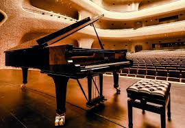

# L'Art et la Science du Piano

*Trente-cinq ans d'expertise technique au service des plus grands instruments : Fazioli, Steinway, Bösendorfer, Bechstein, Shigeru Kawai...*

---

  

Ce site explore l'univers du piano sous tous ses angles, de la tradition artisanale aux innovations scientifiques et technologiques les plus pointues.

## Explorer les connaissances

* **Histoire & Mécanique** : Découvrez l'évolution de l'instrument et les secrets de son fonctionnement mécanique interne.
* **Acoustique & Accordage** : Une introduction approfondie à la physique acoustique, à l'art de l'accordage et à l'inharmonicité des pianos.
* **Systèmes Modernes & Conseils** : L'intégration des technologies (Silent, Dampp-Chaser), l'analyse des pianos japonais et nos conseils d'achat.

---

## À propos de l'auteur

**Stefano Etienne Landi** — [contact@tech-piano.com](mailto:contact@tech-piano.com)

<small>Technicien de pianos avec 35 ans d'expérience, diplômé de l'École Française et lauréat du prix d'excellence des métiers d'art. Il est actuellement responsable technique au sein d'une importante entreprise européenne spécialisée dans les pianos de prestige de haute facture.</small>
