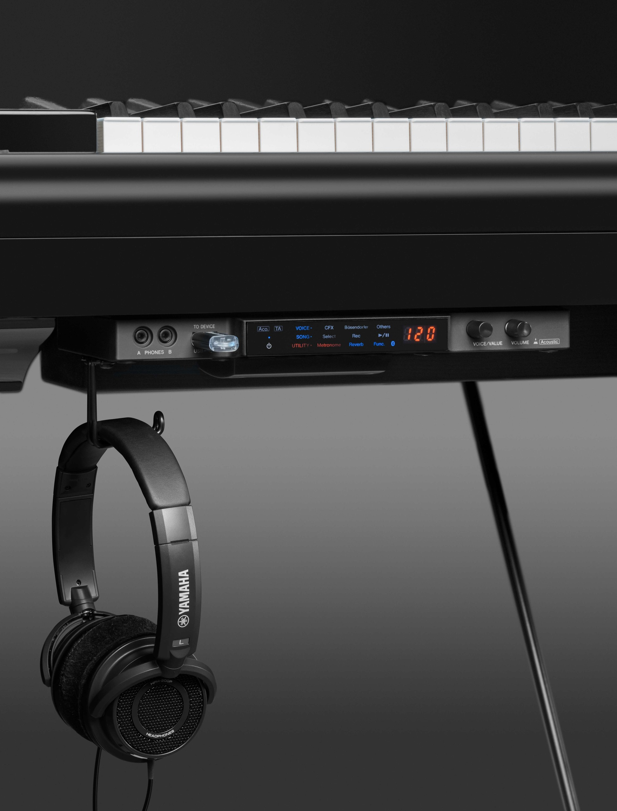

---

title: "pianos Landi - silent"

---

## LE SYSTEME SILENCIEUX-

- Vous pouvez:
jouer à n’importe quelle heure sans gêner autour de vous.
redonner vie a un piano ancien.
vous éviter d’investir dans un piano numérique en plus de votre piano acoustique.
profiter d’un vrai toucher piano tout en ayant les avantages du numérique.
travailler en même temps sur un vrai piano et faire de la MAO avec votre ordinateur.

### Comment cela fonctionne?

- Des capteurs installés sous le clavier transforment chaque note enfoncée. en un signal MIDI retransmis au processeur équipé d'une carte son. Le système ne modifie en rien la sensation au toucher d'un clavier acoustique traditionnel.

- Une barre d'arrêt des marteaux bloque ces derniers en position "silence", avant qu’ils ne frappent les cordes. Il n'y a plus de son acoustique, le système midi prend le relais. Un simple levier caché sous le clavier permet de basculer d’un mode à l’autre ou même les 2 en même temps.
Vous avez aussi la possibilité de vous enregistrer afin de vous aider a travailler votre jeux artistique.

- Le boîtier de contrôle contient plusieurs variétés de sons et des fonctions multiples telles que métronome, pistes d'enregistrement et effets. il peut être branché à un ordinateur et autres équipements compatibles MIDI et système d'amplification.

- Le système s'installe sur presque tous les pianos:
Neufs ou d'occasion facilement ou avec des modifications plus ou moins importantes

- Aujourd'hui il existe plusieures marques et modeles
- Renseignez-vous aupres d'un professionel.